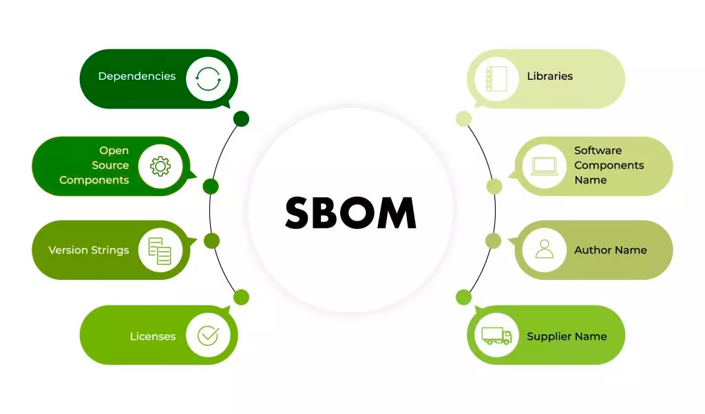
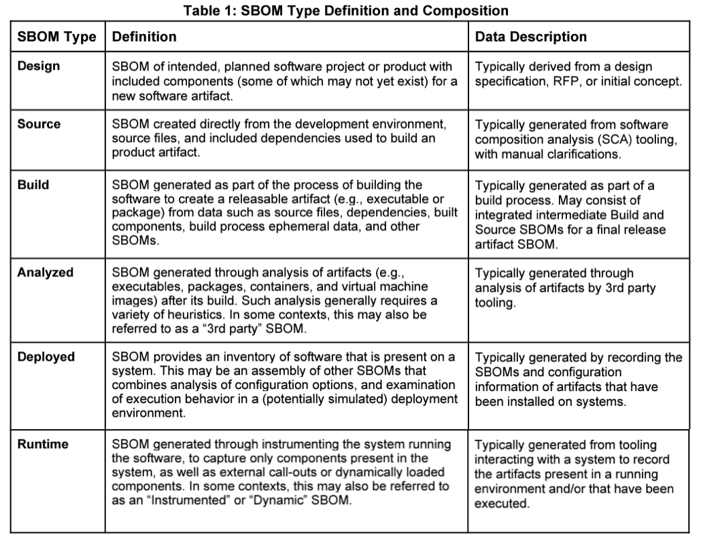
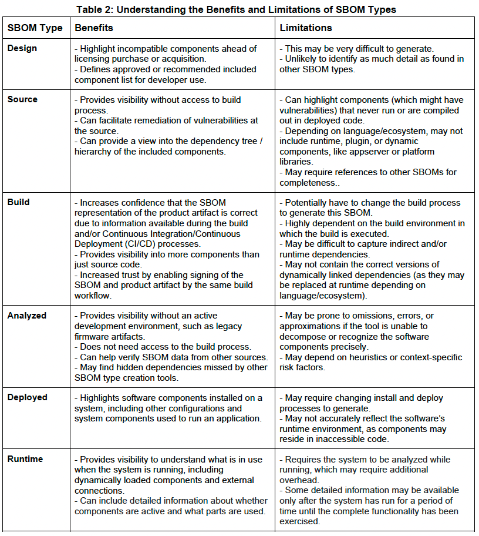

SBOM( software bill of materials) demo
======================================



SBOM（软件物料清单）是一种正式的、结构化的记录。它不仅对软件产品的组件构成进行了详细的说明，同时还描述了这些组件之间的供应链关系。
SBOM概述了应用程序中引入的包和库，以及这些包、库与其他上游项目之间的关系。这在重用代码与引入开源代码的时候非常有用。

国家电信和信息管理局（NTIA）列出了任何SBOM都应该包含的七个数据字段： • 供应商名称：创建、定义和标识组件的实体名称。 • 组件名称：原供应商为软件组件指定的名称 • 组件版本：供应商用于表明先前版本软件做出更改的标识符。 • 其他唯一标识符：用于标识组件或用于相关数据库查找的其他标识符。例如，NIST 的CPE字典中的标识符。 • 依赖关系：描述软件Y中包含上游组件X的关系。这对于开源项目尤为重要。 • SBOM数据的作者：为该组件创建SBOM数据的实体名称。 • 时间戳：记录SBOM数据程序集的日期和时间。

# SBOM Type Definition and Composition



# Understanding the Benefits and Limitations of SBOM Types



# CycloneDX

OWASP CycloneDX is a full-stack Bill of Materials (BOM) standard that provides advanced supply chain capabilities for cyber risk reduction.
The specification supports:

* Software Bill of Materials (SBOM)
* Software-as-a-Service Bill of Materials (SaaSBOM)
* Hardware Bill of Materials (HBOM)
* Machine Learning Bill of Materials (ML-BOM)
* Manufacturing Bill of Materials (MBOM)
* Operations Bill of Materials (OBOM)
* Vulnerability Disclosure Reports (VDR)
* Vulnerability Exploitability eXchange (VEX)

# spdx

The following SPDX fields are populated from the POM project information:

- package name: project name or artifactId if the project name is not provided
- package description: project description
- package shortDescription: project description
- package downloadUrl: distributionManager url
- package homePage: project url
- package supplier: project organization
- package versionInfo: project version
- files for analysis: build source files + project resource files

# SBOM by Paketo buildpacks

Please refer [How to Access the Software Bill of Materials](https://paketo.io/docs/howto/sbom/). 

All sbom files are generated in the `/layers/sbom/launch` directory.

```
management.endpoint.sbom.additional.buildpacks-lifecycle.location=optional:file:/layers/sbom/launch/buildpacksio_lifecycle/launcher/sbom.cdx.json
management.endpoint.sbom.additional.buildpacks-liberica-helper.location=optional:file:/layers/sbom/launch/paketo-buildpacks_bellsoft-liberica/helper/sbom.syft.json
management.endpoint.sbom.additional.buildpacks-liberica-jre.location=optional:file:/layers/sbom/launch/paketo-buildpacks_bellsoft-liberica/jre/sbom.syft.json
management.endpoint.sbom.additional.buildpacks-ca-certificates.location=optional:file:/layers/sbom/launch/paketo-buildpacks_ca-certificates/helper/sbom.syft.json
management.endpoint.sbom.additional.buildpacks-executable-jar.location=optional:file:/layers/sbom/launch/paketo-buildpacks_executable-jar/sbom.cdx.json
management.endpoint.sbom.additional.buildpacks-spring-boot-helper.location=optional:file:/layers/sbom/launch/paketo-buildpacks_spring-boot/helper/sbom.syft.json
management.endpoint.sbom.additional.buildpacks-spring-boot-spring-cloud-bindings.location=optional:file:/layers/sbom/launch/paketo-buildpacks_spring-boot/spring-cloud-bindings/sbom.syft.json
```

# References

* SOFTWARE BILL OF MATERIALS: https://www.ntia.gov/page/software-bill-materials
* What is a Software Bill of Materials (SBOM)? https://scribesecurity.com/sbom/
* 什么是 SBOM（软件物料清单）: https://www.dwcon.cn/post/2094
* CycloneDX: https://cyclonedx.org/
* SPDX: Software Package Data Exchange - https://spdx.dev/
* How to create SBOMs in Java with Maven and Gradle: https://snyk.io/blog/create-sboms-java-maven-gradle/
* CycloneDX Maven Plugin: https://github.com/CycloneDX/cyclonedx-maven-plugin
* spdx-maven-plugin: https://github.com/spdx/spdx-maven-plugin
* Apache Bill of Materials (BOM) POMs: https://maven.apache.org/guides/introduction/introduction-to-dependency-mechanism.html#bill-of-materials-bom-poms
* Implement SBOM actuator endpoint: https://github.com/spring-projects/spring-boot/pull/39799
* syft: a CLI tool and Go library for generating a Software Bill of Materials (SBOM) from container images and filesystems https://github.com/anchore/syft
* Paketo: How to Access the Software Bill of Materials - https://paketo.io/docs/howto/sbom/ 
* Implement SBOM actuator endpoint: https://github.com/spring-projects/spring-boot/pull/39799